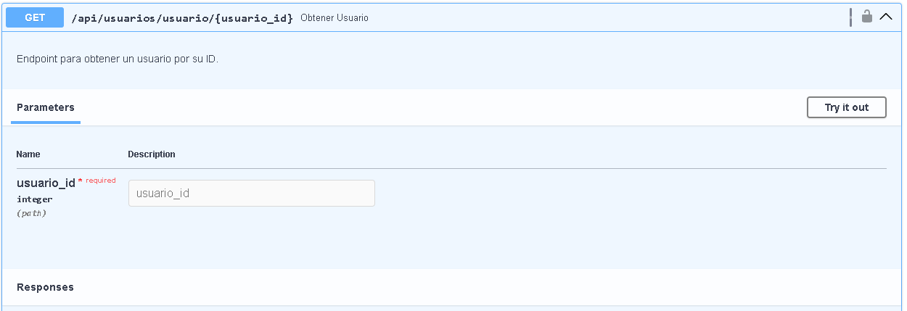
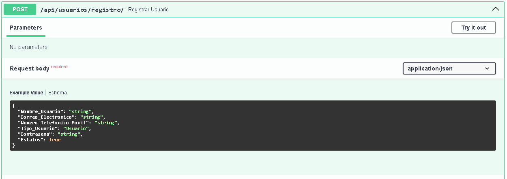
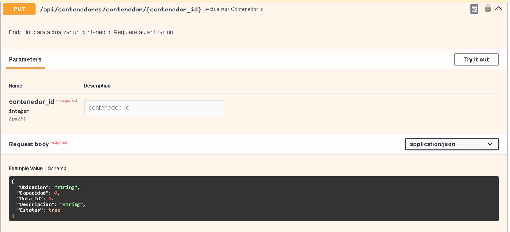
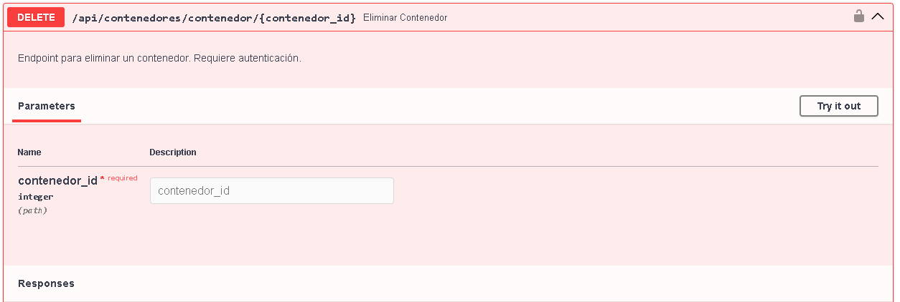
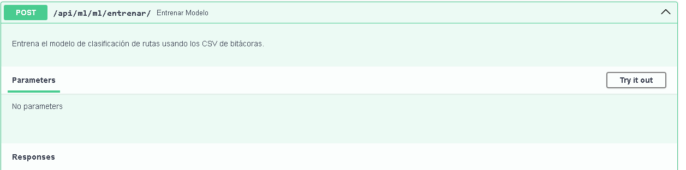
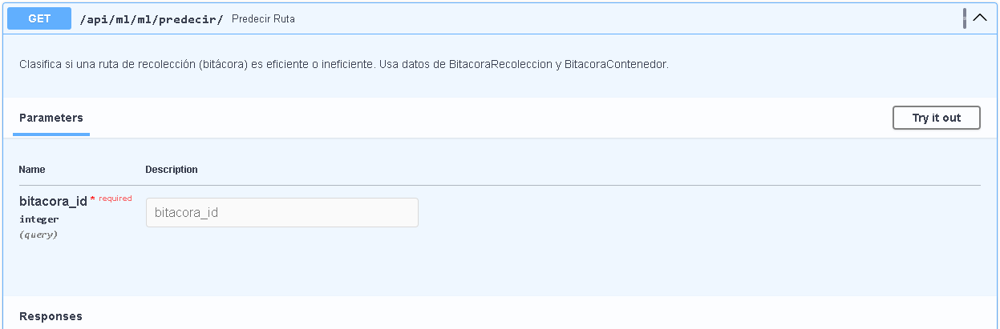
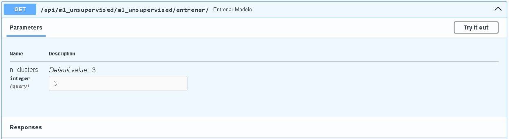
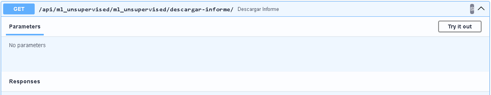

# Api

## codigo fuente
liga al repositorio

## Operaciones crud basicas
Explicacion brebe de las operaciones get, put patch, delete, post que se diseñaron

## Listado de endpoints de las entidades
Tabla que contendra los endpoints y descripcion de la funcionalidD SObre las entidades

## Screenshots
de los endpoints que generan las operaciones crud

## endpoints que utilizan ML
Explicacion de las operaciones get, put patch, delete, post que se diseñaron

##  listado de enpoints que consumen ml  
tabla que contendra los endpoints ybdescripcion de las funcionalidad sobre los algoritmos de analisis de datos

## Screenshots
de los endpoints que generan las operaciones del analisis supervisado y no supervisado
# SmartWaste API

## 📂 Código Fuente

Puedes acceder al código fuente completo del proyecto en el siguiente repositorio:

👉 [https://github.com/JoseLuisCM663/SmartWasteApi](https://github.com/JoseLuisCM663/SmartWasteApi)

---

## 🔄 Operaciones CRUD Básicas

La API implementa operaciones CRUD para gestionar los recursos del sistema de residuos inteligentes:

- **GET**: Recupera información sobre recursos existentes.
- **POST**: Crea nuevos registros.
- **PUT**: Actualiza completamente un recurso.
- **PATCH**: Actualiza parcialmente un recurso.
- **DELETE**: Elimina un recurso de la base de datos.

Estas operaciones permiten interactuar con entidades como usuarios, sensores, contenedores y rutas de recolección.

---

## 📋 Endpoints CRUD de las Entidades

| Método | Endpoint                  | Descripción                                      |
|--------|---------------------------|--------------------------------------------------|
| GET    | `/usuarios/`              | Lista todos los usuarios                          |
| POST   | `/usuarios/`              | Crea un usuario                                  |
| GET    | `/usuarios/{id}`          | Detalle de un usuario                             |
| PUT    | `/usuarios/{id}`          | Actualiza completamente un usuario               |
| DELETE | `/usuarios/{id}`          | Elimina un usuario                                |
| GET    | `/sensores/`              | Lista todos los sensores                          |
| POST   | `/sensores/`              | Crea un sensor                                   |
| GET    | `/sensores/{id}`          | Detalle de un sensor                              |
| PUT    | `/sensores/{id}`          | Actualiza completamente un sensor                |
| DELETE | `/sensores/{id}`          | Elimina un sensor                                |
| GET    | `/contenedores/`          | Lista todos los contenedores                      |
| POST   | `/contenedores/`          | Crea un contenedor                               |
| GET    | `/contenedores/{id}`      | Detalle de un contenedor                          |
| PUT    | `/contenedores/{id}`      | Actualiza completamente un contenedor            |
| DELETE | `/contenedores/{id}`      | Elimina un contenedor                             |
| GET    | `/rutas/`                 | Lista todas las rutas                              |
| POST   | `/rutas/`                 | Crea una ruta                                    |
| GET    | `/rutas/{id}`             | Detalle de una ruta                               |
| PUT    | `/rutas/{id}`             | Actualiza completamente una ruta                 |
| DELETE | `/rutas/{id}`             | Elimina una ruta                                  |

---

## 🤖 Endpoints de Machine Learning

La API cuenta con endpoints de ML para análisis predictivo de rutas y eficiencia de la recolección:

| Método | Endpoint                  | Descripción                                      |
|--------|---------------------------|--------------------------------------------------|
| POST   | `/ml/entrenar/`           | Entrena el modelo de clasificación usando las bitácoras de recolección y contenedores |
| GET    | `/ml/predecir/`           | Predice si una ruta (bitácora) es eficiente o ineficiente usando la base de datos y el modelo entrenado |

### Detalles de Uso

- **POST `/ml/entrenar/`**  
  Entrena el modelo con los CSV de bitácoras:  
  - `public/bitacora_recoleccion_etl.csv`  
  - `public/bitacora_contenedor_etl.csv`  

- **GET `/ml/predecir/?bitacora_id={id}`**  
  Clasifica si una bitácora de recolección es eficiente o ineficiente.  

---
## 📋 Endpoints de ML No Supervisado

| Método | Endpoint                       | Descripción                                         | Parámetros                                         |
|--------|--------------------------------|-----------------------------------------------------|--------------------------------------------------|
| GET    | `/ml_unsupervised/entrenar/`   | Entrena un modelo de clustering (KMeans) usando los datos de sensores. Genera un informe PDF con los resultados. | `n_clusters` (opcional, default=3): número de clusters |
| GET    | `/ml_unsupervised/descargar-informe/` | Descarga el PDF generado con el informe de clusters. | Ninguno                                           |

## 🔧 Detalles de Uso

### Entrenar Modelo

**GET** `/ml_unsupervised/entrenar/?n_clusters=3`  

- Entrena el modelo KMeans sobre los datos de `lecturas_todos_sensores.csv`.  
- Genera un PDF con los resultados y gráficas de los clusters.  
- Respuesta JSON:

```json
{
  "detail": "Modelo entrenado y PDF generado",
  "modelo_path": "public/modelos/kmeans_model.pkl",
  "informe_path": "public/informe_clusters.pdf"
}
```

### Descargar Informe

**GET** `/ml_unsupervised/descargar-informe/`

- Devuelve el informe PDF generado en el entrenamiento.
- Respuesta: Archivo PDF (`informe_clusters.pdf`).


## 📸 Capturas de Pantalla

### Endpoints CRUD
- **GET /usuarios/**  
  

- **POST /usuarios/**  
  

- **PUT /usuarios/{id}**  
  

- **DELETE /usuarios/{id}**  
  

### Endpoints ML
- **POST /ml/entrenar/**  
  

- **GET /ml/predecir/**  
  

### Endpoints ML
- **GET /ml_unsupervised/entrenar/**  
  

- **GET /ml_unsupervised/descargar-informe/**  
  
---

