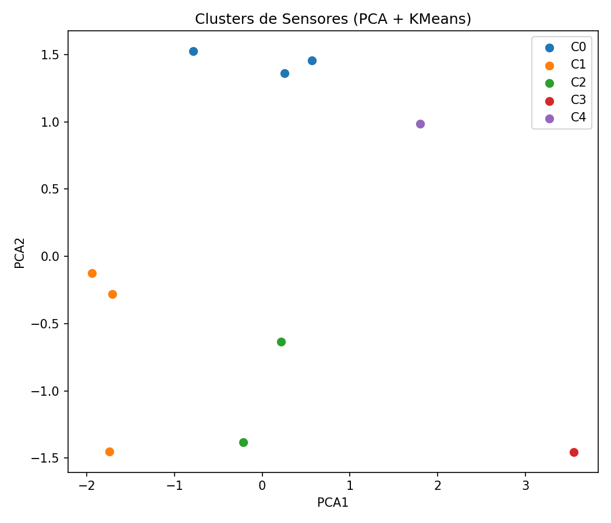

# 🔍 Modelo de Aprendizaje No Supervisado - SmartWasteWeb

## 📋 Propuesta de Aplicación

El análisis no supervisado se aplica para **agrupar comportamientos similares de sensores de residuos**, con el fin de detectar patrones en el nivel de llenado, temperatura y humedad de los contenedores. Esto permite:

* 🔎 **Agrupar sensores** con comportamiento similar.
* 🚨 **Detectar contenedores anómalos** (con llenado rápido o muy lento).
* 📉 **Reducir la dimensionalidad** para facilitar visualización.
* 📦 **Optimizar rutas de recolección** basadas en patrones de llenado.
* 🔁 **Mejorar el mantenimiento predictivo** de sensores y contenedores.

---

## 🔧 Elección del Mecanismo a Utilizar

Se elige el algoritmo **K-Means**, ya que permite:

* ✅ Agrupar sensores según su comportamiento (nivel, temperatura, humedad).
* ✅ Detectar automáticamente segmentos de datos sin etiquetas.
* ✅ Aplicar PCA para visualización 2D/3D.
* ✅ Calcular métricas de cohesión de clústeres (Silhouette Score).

```python
from sklearn.cluster import KMeans
kmeans = KMeans(n_clusters=4, random_state=42)
kmeans.fit(data_scaled)
```

---

## 📚 Marco Teórico

**K-Means** agrupa observaciones en K clústeres minimizando la distancia a los centroides:

### Fórmulas:

**Función objetivo:**

```
J = Σ Σ ||xi - μj||²
```

donde `μj` es el centroide del clúster j.

**Pasos del algoritmo:**

1. Inicializar K centroides.
2. Asignar cada punto al centroide más cercano.
3. Recalcular centroides.
4. Repetir hasta convergencia.

**PCA** (Análisis de Componentes Principales) reduce dimensiones maximizando la varianza explicada por nuevas variables ortogonales.

---

## ⚡ Aplicación del Mecanismo

```python
# Escalamiento
from sklearn.preprocessing import StandardScaler
scaler = StandardScaler()
data_scaled = scaler.fit_transform(sensor_df)

# PCA
from sklearn.decomposition import PCA
pca = PCA(n_components=2)
pca_result = pca.fit_transform(data_scaled)
sensor_df['PCA1'] = pca_result[:, 0]
sensor_df['PCA2'] = pca_result[:, 1]

# K-Means
from sklearn.cluster import KMeans
kmeans = KMeans(n_clusters=3)
clusters = kmeans.fit_predict(data_scaled)
sensor_df['cluster'] = clusters
```

---

## 📊 Gráficos Generados

### 1. 📌 Agrupamiento PCA (K-Means):



```python
sns.scatterplot(data=sensor_df, x='PCA1', y='PCA2', hue='cluster', palette='Set2')
```

### 2. 📊 Promedio por Clúster:

.png)

```python
group_means = sensor_df.groupby('cluster')[['nivel', 'temperatura', 'humedad']].mean()
group_means.plot(kind='bar', figsize=(6, 4))
```

### 3. 📦 Distribución (Boxplot por variable):

.png)

```python
sensor_df_melted = pd.melt(sensor_df, id_vars='cluster', value_vars=['nivel', 'temperatura', 'humedad'], var_name='Variable', value_name='Valor')
sns.boxplot(x='Variable', y='Valor', hue='cluster', data=sensor_df_melted, palette='Set2')
```

---

## 📈 Resultados Obtenidos

| Clúster | Promedio Nivel | Promedio Temp | Promedio Humedad |
| ------- | -------------- | ------------- | ---------------- |
| 0       | Bajo           | Medio         | Alta             |
| 1       | Alto           | Alta          | Media            |
| 2       | Medio          | Baja          | Baja             |

* 🚨 Sensores con comportamiento anómalo fueron agrupados.
* 📊 Se identificaron clústeres útiles para diseñar rutas y alertas.

---

## ✅ Conclusión de la Fase del Proyecto

Esta fase **revela patrones de comportamiento** en los sensores sin requerir etiquetas o supervisión previa. La agrupación automática permite:

* 🌐 Mejor planificación de recolección.
* 📍 Focalizar mantenimiento en sensores anómalos.
* 📉 Reducir costos por recorridos innecesarios.
* 💡 Aportar inteligencia al sistema SmartWasteWeb.

La **combinación de K-Means + PCA** permite integrar el análisis no supervisado de forma simple, rápida y visualmente interpretable.

ñ