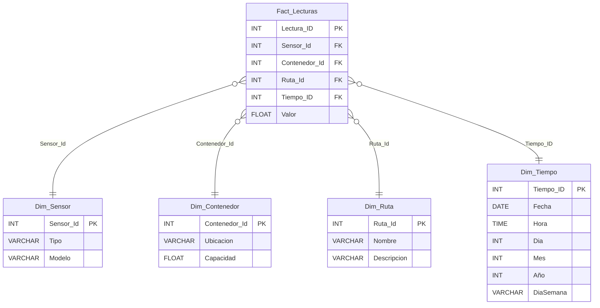

# 🧱 Propuesta de Datawarehouse - SmartWasteApi

## 📌 Contexto de un Datawarehouse en el Proyecto

El sistema SmartWasteApi genera continuamente lecturas de sensores en los contenedores de residuos, incluyendo nivel de llenado y condiciones del entorno. Estas lecturas son valiosas no solo en tiempo real, sino también como históricos para optimizar rutas de recolección, anticipar mantenimientos y analizar patrones de generación de residuos.

Un Datawarehouse permitirá centralizar esta información en un esquema optimizado para análisis (OLAP), facilitando consultas multidimensionales y soportando la toma de decisiones estratégicas.

## 🏗️ Modelo Propuesto (Esquema en Estrella)

El modelo propuesto se basa en un esquema en estrella, con una tabla de hechos central (Fact_Lecturas) y cuatro dimensiones principales.

### 🔹 Tabla de Hechos: Fact_Lecturas

Almacena las métricas medibles del sistema.

| Campo         | Tipo  | Clave | Descripción                                                     |
|---------------|-------|:-----:|-----------------------------------------------------------------|
| Lectura_ID    | INT   |  PK   | Identificador único de la lectura                               |
| Sensor_Id     | INT   |  FK   | → `Dim_Sensor.Sensor_Id`                                        |
| Contenedor_Id | INT   |  FK   | → `Dim_Contenedor.Contenedor_Id`                                |
| Ruta_Id       | INT   |  FK   | → `Dim_Ruta.Ruta_Id`                                            |
| Tiempo_ID     | INT   |  FK   | → `Dim_Tiempo.Tiempo_ID`                                        |
| Valor         | FLOAT |       | Nivel de llenado del contenedor en % (0–100)                    |

### 🔹 Dimensión: Dim_Sensor

| Campo     | Tipo    | Clave | Descripción                              |
|-----------|---------|:-----:|------------------------------------------|
| Sensor_Id | INT     |  PK   | Identificador único del sensor           |
| Tipo      | VARCHAR |       | Tipo (ultrasónico, presión, etc.)        |
| Modelo    | VARCHAR |       | Modelo o referencia del fabricante       |

### 🔹 Dimensión: Dim_Contenedor

| Campo         | Tipo    | Clave | Descripción                       |
|---------------|---------|:-----:|-----------------------------------|
| Contenedor_Id | INT     |  PK   | Identificador único del contenedor|
| Ubicacion     | VARCHAR |       | Dirección o zona                   |
| Capacidad     | FLOAT   |       | Capacidad máxima en litros         |

### 🔹 Dimensión: Dim_Ruta

| Campo    | Tipo    | Clave | Descripción                |
|----------|---------|:-----:|----------------------------|
| Ruta_Id  | INT     |  PK   | Identificador de la ruta   |
| Nombre   | VARCHAR |       | Nombre de la ruta          |
| Descripcion | VARCHAR |    | Observaciones adicionales  |

### 🔹 Dimensión: Dim_Tiempo

| Campo      | Tipo    | Clave | Descripción                         |
|------------|---------|:-----:|-------------------------------------|
| Tiempo_ID  | INT     |  PK   | Identificador del tiempo            |
| Fecha      | DATE    |       | Fecha de la lectura                 |
| Hora       | TIME    |       | Hora de la lectura                  |
| Dia        | INT     |       | Día del mes                         |
| Mes        | INT     |       | Mes                                 |
| Año        | INT     |       | Año                                 |
| DiaSemana  | VARCHAR |       | Nombre del día (Lunes, Martes, …)   |

---

## 📈 Diagrama (Mermaid)

## 🎯 Propuesta de Orígenes de Datos Alternativos

Además de los datos generados por los sensores, se pueden integrar otras fuentes externas en el Datawarehouse:

Meteorología (APIs públicas, ej. OpenWeatherMap)
Relacionar clima (lluvia, calor, humedad) con generación de residuos.

Demografía (INEGI / censos poblacionales)
Conectar densidad de población por zona con niveles de llenado.

Calendarios de eventos locales
Identificar patrones de aumento de residuos en festividades o ferias.

## 💡 5 Experimentos de Asociación de Datos
Nivel de llenado vs Rutas
Evaluar si los recorridos actuales evitan sobrellenado.

Nivel de llenado vs Densidad poblacional
Hipótesis: zonas más habitadas → más residuos.

Humedad sensor vs Clima real
Detectar si humedad elevada es por lluvia o falla en contenedor.

Eventos locales vs Generación de residuos
Correlación de festividades con picos de llenado.

Tiempo de llenado vs Capacidad del contenedor
Optimizar diseño e instalación de nuevos contenedores.

## ✅ Toma de Decisiones (5 Supuestos)
Si los contenedores se llenan más rápido en zonas densas, se asignarán contenedores adicionales.

Si la lluvia genera lecturas falsas de humedad, se planificarán mantenimientos preventivos.

Si eventos comunitarios aumentan el llenado, se crearán rutas temporales de recolección.

Si rutas actuales generan sobrellenados, se rediseñarán los itinerarios de camiones.

Si los patrones climáticos influyen, se aplicarán ajustes dinámicos con base en pronósticos.